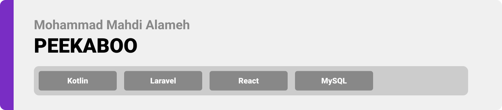
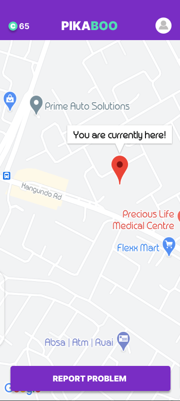
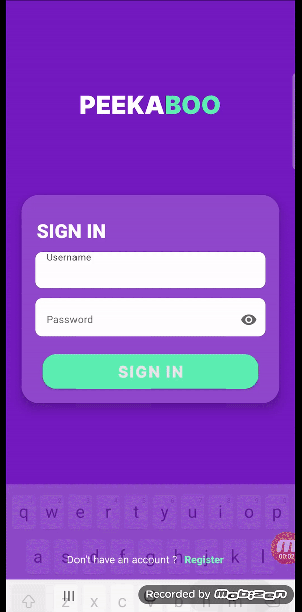
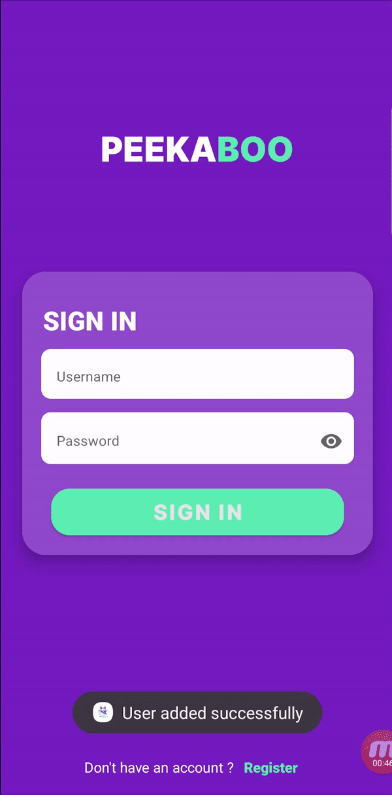
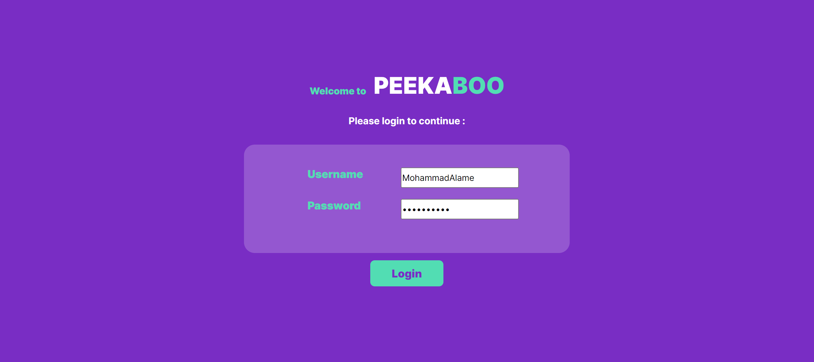
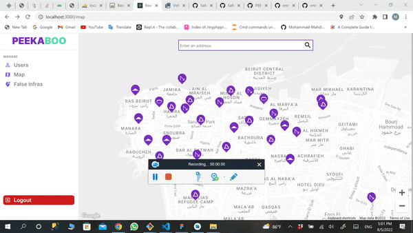
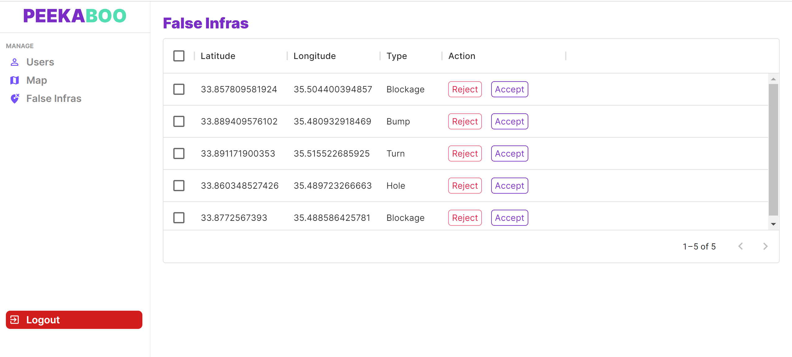

<div align="center">

> Hello world! This is the project’s summary that describes the project plain and simple, limited to the space available. 


**[PROJECT PHILOSOPHY](#philosophy) • [WIREFRAMES](#wireframes) • [TECH STACK](#stacks) • [IMPLEMENTATION](#implementation) • [HOW TO RUN?](#run)**

</div>

<br><br>


> The PEEKABOO app is a live-tracking app , that notifies the users before they reach any infrastructural problem (infra) in seven seconds. The PEEKABOO app is more than just another tracking app; it enhances and fulfills the driving experience you are looking for.
> 


### User Stories
- As a user, I want to know of the presence of infrastructural problem before I reach it , and have the enough time to avoid it (complete stop , redirection ...).
- As a user, I want to report the presence of any  infrastructural problem I face, or already faced.(even if I wasn't moving)
- As a user, I want to report if this infrastructural problem is false.
- As a user, I want to see the status of my request regarding false infrastructural problem (pending , rejected, accepted).
- As a user, I want to see all infrastructural problems reported by me.

<br>

### Admin Stories
- As a admin, I want to manage all the users and see their report history.
- As a admin, I want to report the presence of any infrastructural problem whenever I want.
- As a admin, I want to delete (fix) any infrastructural problem immedietly.
- As a admin, I want to accept, and reject any user request regarding false infrastructural problem.


<br><br>


> This design was planned before on paper, then moved to Figma app for the fine details.
Note that i didn't use any styling library or theme, all from scratch and using pure css modules
### Wireframes of the user's mobile app 

| Sign In  | Register  | Map | Report  |
| -----------------| -----------------|-----------------| -----------------|
|  |  | | |
### Wireframes of the admin's webiste (panel) 
| Map | Users |
| ----------------------- | -------|
|  |   |
<br>

<br><br>


Here's a brief high-level overview of the tech stack PEEKABOO uses:

- This project uses the [Kotlin language](https://kotlinlang.org/docs/home.html). Kotlin is a cross-platform, statically typed, general-purpose programming language with type inference, announced by google as the preferred language for Android app developers.

- The admin panel uses [React](https://reactjs.org/). React is a JavaScript library for building user interfaces.

- For persistent storage (database), the app uses [MySQL](https://www.mysql.com/) to store the data and [Laravel](https://laravel.com/) as the backend framework.

- To track the users live location, the app uses [firebase](https://firebase.google.com/docs) which supports Android, iOS, and macOS.

- [JSON Web Tokens](https://jwt.io/) which is an open standard used to share security information between two parties.

- This project uses [google-maps](https://www.google.com/maps) to fetch and access google maps, [google-places-autocomplete](https://www.npmjs.com/package/react-google-places-autocomplete), and [reach-combobox](https://reach.tech/combobox).

-This project usese [mui-datagrid](https://mui.com/x/react-data-grid)

- The app uses the font ["Inter"](https://fonts.google.com/specimen/Inter) as its main font, and the design of the app adheres to the material design guidelines.


<br><br>


> Using the above mentioned tech stacks and the wireframes build with figma from the user sotries we have, the implementation of the app is shown as below, these are screenshots from the real app


<br>

### Implementation of the user's mobile app (the joystick used below in some pages is a mock gps creator, used for tesing the app)

| Register  | Login |
| -----------------| -----------------|
|  |  |

| Report False Infra | Foreground Service used for tracking ; starting it after successful login , and stopping it after successful logout|
| -----------------| -----------------|
|  | 

| Edit User | Edit Password  |
|  -----|-----|
|  | 

|Report History | False Requests |
|-----|-----|
|  ||


|Sending notifications of near infra when map is opened and the user have less than 7 seconds on impact | Sending notification of near infra (from foreground service and you can see it running and showing notification)|
|-----|-----|
|||

|Report infra while moving (so when the user clicks report, an infra will be saved on his live location)| Report infras any where on the map by just pressing anypoint on the map |
| -----| -----|
|   | |


### Implementation of the admins's website

|Login |
| -----------------|
||

| Landing Page |
|-----------------|
||

|Adding Infra |
| -----------------| 
||

|Deleting (fixing) Infra | 
|-----------------|
||

|Search | 
|-----------------|
||


|Adding Infra (Static) |
|-----------------|
||

|Deleting Infra (Static) |
|-----------------|
||

|Search (Static) |
|-----------------|
||

|Manage false Infras |
|-----------------|
||

|Manage Users | 
| -----------------|
||

|View User |
|-----------------|
||


<br><br>


> To get a local copy up and running follow these simple steps.
### Prerequisites

- Download and Install [Composer](https://getcomposer.org/download/)
- Download and Install [XAMPP](https://www.apachefriends.org/download.html)

### Installation

1. Clone the repo

   ```sh
   git clone https://github.com/Mohammad-Mahdi-Alameh/PEEKABOO.git
   ```

#### To Run Laravel Server on your machine

1. Create a database locally named peekaboodb

2. Navigate to the backend folder
   ```sh
   cd PEEKABOO/peekaboo-backend-laravel
   ```
3. Inside the .env file in your backend folder
   - Insert the db name as follow -> DB_DATABASE= -> DB_DATABASE=peekaboodb
4. Run migration
   ```sh
   php artisan migrate
   ```
5. Run the seeder
   ```sh
   php artisan db:seed
   ```
6. Start the Server
   ```sh
   Run php artisan serve
   ```
7. Start the worker
   ```sh
   php artisan queue:work
   ```